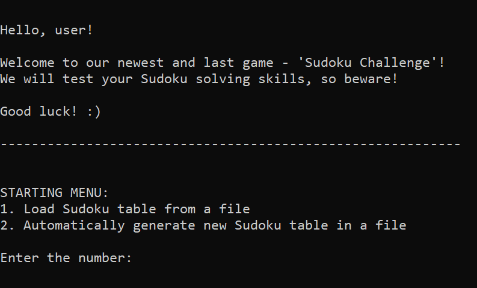
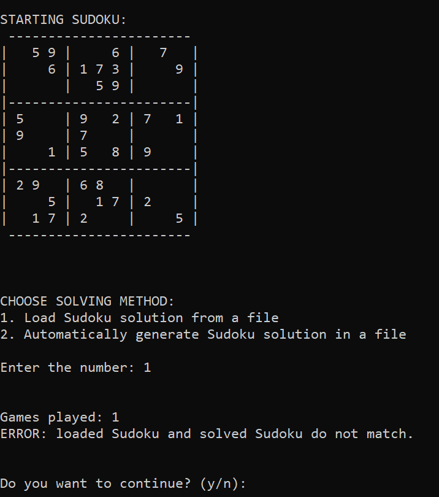
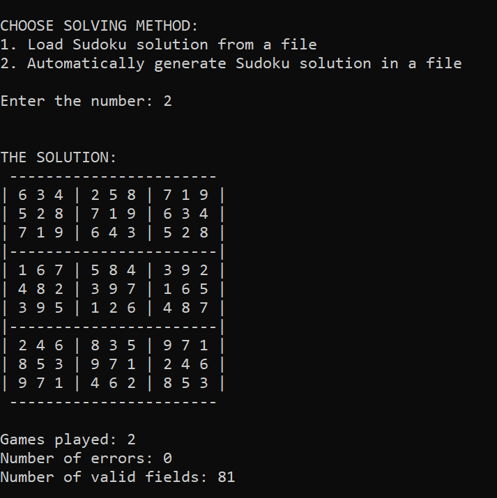

# Sudoku 🔢

A console application for the classic game Sudoku.

---

This was an university project for the course "Object-Oriented Programming 2", taken in the 3rd semester of the Software Engineering and Information Technologies program.

The ``goal`` of the project was to:
- apply OOP techniques,
- work with pointers in C++,
- write adequate documentation for the project description

#
Technologies used: 
- ``C++``
#
Date: January, 2024.

---

# How does it work? ❓
- allows users to either load an existing puzzle from a file or generate a new one,
- users can input their solution or let the program solve the puzzle,
- after completion, the app displays game statistics, including correct placements, errors, and game count,
- users can choose to play again for a new iteration

> NOTE: since this is a console application and it prints symbols, the visual design will vary depending on which OS you run it on. The project was done in Visual Studio on Windows, so the table will look clean if you run it from there, but it will probably break or look uneven on any other OS.

---

# Visual Design ✨

# 

---

# Using the Application ⚙️

To use this application, follow the next steps:
1) clone this repo,
2) open the project in C++ IDE or click directly on the "SudokuProjekat.sln" file in the downloaded folder,
3) before running the "main.cpp" that is in Source Files, it is necessary to pass the arguments through the command line:
- in Visual Studio, you can do this by selecting the option Debug, and clicking on "SudokuProjekat Debug Properties" (last option),
- after that, go into "Debugging" and in "Command Arguments" type: "``sudokuLoadFile.txt sudokuSolutionFile.txt``", without ' "" ', which represent the two files in the Resource Files,
- the application loads the **_Sudoku_** **_table_** from the file "``sudokuLoadFile.txt``" and checks the **_solution_** in the "``sudokuSolutionFile.txt``" file,
- feel free to rename the files, but ensure that it aligns with the arguments

> NOTE: The Sudoku table layout must remain unchanged; only the numbers can be modified. Altering the layout will result in the program not functioning correctly.

---

# Examples 💡

You can choose one of two options on the menu:
1. ``"Load Sudoku table from a file"``: the application loads your Sudoku puzzle from the "sudokuLoadFile.txt" file.
- 1.1. "Load Sudoku solution from a file": this checks the solution in the "sudokuSolutionFile.txt" file, and outputs the game statistics.
- 1.2. "Automatically generate Sudoku solution in a file": generates a random solution to the given puzzle (if it's possible).
# 
2. ``"Automatically generate new Sudoku table in a file"``:
- 2.1. "Load Sudoku solution from a file": this checks the solution in the "sudokuSolutionFile.txt" file, and outputs the game statistics.
- 2.2. "Automatically generate Sudoku solution in a file": generates a random solution to the given puzzle (if it's possible).
